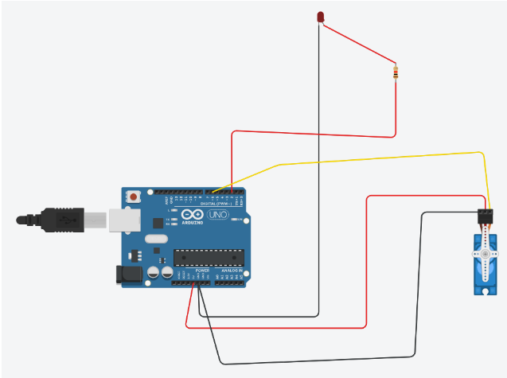

Mô tả: Kho lưu này xây dựng ứng dụng thử nghiệm của bài toán nhận dạng giọng nói tiếng Việt tự động sử dụng mô hình wav2vec 2.0
Cụ thể hơn trong kho lưu trữ này chúng ta sẽ xây dựng hệ thống điều khiển các thiết bị ở đây là đèn led và servo bằng giọng nói
Để có thể chạy thử nghiệm này chúng ta cần làm các bước sau:

Trước khi thực hiện các bước này hãy đảm bảo bạn đã cài python 3.10.6, các phiên bản khác có khả năng gây ra lỗi, và bạn đã có một code editor(VS code,Pycharm,...) thuận tiện để soạn mã .
Hãy đảm bảo bạn đã nắm được cách sử dụng Python and Arduino.

#Step1: Đầu tiên bạn hãy git clone repo này về máy của bạn. Cài đặt môi trường để chạy repo

#Step2: bây giờ hãy cài các thư viện cần thiết cho các file mã bằng cách chạy các lệnh sau trong terminal
- pip install torch==2.1.0 torchvision==0.16.0 torchaudio==2.1.0 --index-url https://download.pytorch.org/whl/cu118
- pip install -r VN-ASR-Demo/requirements.txt
- pip install transformers

Note: chú ý khi clone về bạn hãy đổi tên thư mục tải về bời vì mình sơ xuất đặt tên repo có dấu "." khi clone về chạy nó sẽ lỗi ko tải được file. Đổi Vietnamese-Automatic-Speech-Recognition-Use-Wav2vec2.0-And-Demo-Control-led-servo thành tên nào ngắn gọn ko có "."

#Step3: Bạn cần đấu nối mạch như sau, sau đó kết nối Arduino với máy tính của bạn

#Step4: Bạn cần mở Arduino IDE nạp mã trong file control_led_servo/control_led_servo.ino vào Arduino, hãy kiểm tra xem mã đã được nạp vào đúng chưa bằng cách mở serial monitor và nhập "1_L" nếu đèn sáng thì đã thành công

#Step5: Hãy tắt Arduino IDE , và trong repo bạn clone về hãy chạy lệnh 
- streamlit run "path to app_control_led_servo_streamlit.py file"
- ví dụ :streamlit run VN-ASR-demo/app/app_control_led_servo_streamlit.py
Và cuối cùng có thể khi bạn thực hiện các bước trên có thể sẽ xuất hiện một số lỗi đường dẫn, hãy chứ ý các đường dẫn trong lỗi

#Ngoài ra khi thực hiên xong bước 3, bạn có thể chạy lệnh:
- streamlit run VN-ASR-demo/app/app.py

#Sẽ xuất hiện một giao diện để bạn thử chạy model wav2vec 2.0 với đầu vào là 1 file .wav or giọng nói được ghi âm từ micro